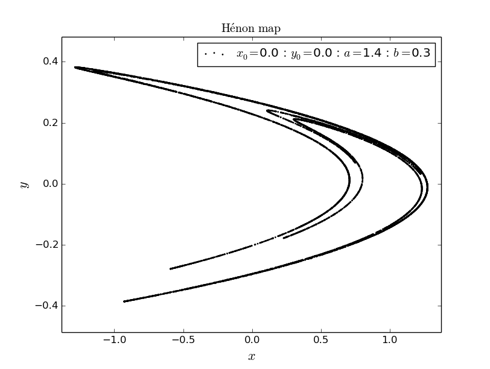
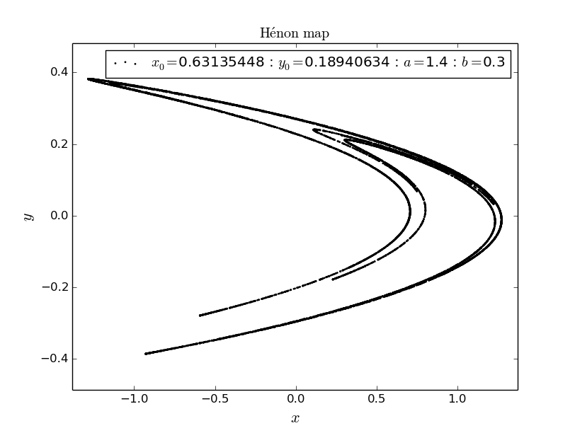
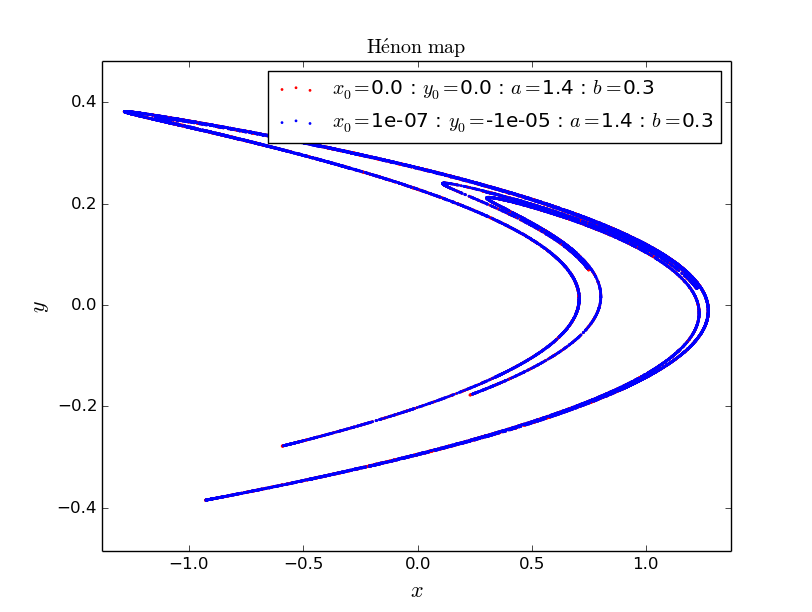

.. _6-12-label:

===============================================================================
問題6.12 - エノン写像
===============================================================================

.. contents::

シミュレーションの目的
============================

これまでは、さまざまな点で教育的であるロジスティック写像について議論してきた。今回は2次元の写像

.. math:: x_{n+1} = y_{n} + 1 - ax_{n}^{2}
    :label: e1

.. math:: y_{n+1} = bx_{n}
    :label: e2

で与えられる点(\ :math:`x_{n}`\ ,\ :math:`y_{n}`\ )の例を考える。写像\ :eq:`e1`\ ,\ :eq:`e2`\ はエノン(H\'{e}non)により最初に考えられたもので、小惑星や衛星の振る舞いとの関連がその動機であった。

作成したプログラム
=============================

本シミュレーションで作成・使用したプログラムを以下に示す。

* パラメータの設定ダイアログ( :download:`SetParameter.py <SetParameter.py>` )

.. literalinclude:: SetParameter.py
    :language: python
    :linenos:

* エノン写像の描画を行うプログラム( :download:`Henon.py <Henon.py>` )

このプログラムでは、実際の写像の値の計算の反復とその描画の指示を行っており、シミュレーションの中核となる部分である。大きく分けて3つの部分からなっており、SetParameterから値を代入する部分(assignment)、式\ :eq:`e1`\ \ :eq:`e2`\ に基づいて時間発展を計算する部分(calc)、そしてその値をプロットする部分(plot_x_and_y)である。それぞれの部分は互いに独立していて、本体の方で関数を呼び出してやる必要がある。これはテストの際の効率化と、関数の再利用性を考慮に入れたためである。

.. literalinclude:: Henon.py
    :language: python
    :linenos:

* 実習課題aで用いるプログラム( :download:`6-12_henon-a.py <6-12_henon-a.py>` )

課題aを実行するため、単純に与えたパラメータからエノン写像を描画するプログラムとなっている。

.. literalinclude:: 6-12_henon-a.py
    :language: python
    :linenos:

* 実習課題cで用いるプログラム( :download:`6-12_henon-c.py <6-12_henon-c.py>` )

課題cを実行するため、設定したパラメータと、そこからプログラム内で与えた\ :math:`\Delta x_{0}`\ 、\ :math:`\Delta y_{0}`\ だけ初期条件のずれた2つのエノン写像を描画するプログラムである。Henonの関数plot_x_and_yにshowing=Falseを指定することで、プロットしたグラフが表示されないようにでき、2つ目の曲線を重ねて描くことができる。

.. literalinclude:: 6-12_henon-c.py
    :language: python
    :linenos:

実習課題
=====================

a. \ :math:`a=1.4`\ および\ :math:`b=0.3`\ として、式\ :eq:`e1`\ ,\ :eq:`e2`\ の計算を反復して行え。\ :math:`x_{0}=0`\ ,\ :math:`y_{0}=0`\ から始め、\ :math:`10^{4}`\ 回の反復の結果をプロットせよ。始めの過渡的な期間の結果はプロットしない。第2の初期条件\ :math:`x_{0}=0.63 135 448`\ 、\ :math:`y_{0}=0.18 940 634`\ から始めて同様の図を描いて、それら2つの図の形を比較せよ。2つの曲線の形は初期条件によらないか。
 
:math:`a=1.4`\ 、\ :math:`b=0.3`\ として式\ :eq:`e1`\ \ :eq:`e2`\ の計算を行い、初期値\ :math:`x_{0}=0`\ 、\ :math:`y_{0}=0`\ から始めて\ :math:`10^{4}`\ 回の反復の結果をプロットする。2.3で示したプログラムによりこれを実行し、得られたグラフを\ :num:`図#fig-6-12-f1`\ に示す。このグラフから、\ :math:`x`\ -\ :math:`y`\ で描かれる曲線は円弧状の拡がりの中で折りたたまれたような形となっていることが分かる。次に、初期条件を\ :math:`x_{0}=0.63 135 448`\ 、\ :math:`y_{0}=0.18 940 634`\ としたときのグラフを\ :num:`図#fig-6-12-f2`\ に示す。このグラフは先の図と同じ形状をしており、曲線の形は初期条件によらないことが分かる。

.. _fig-6-12-f1:

    
    初期値\ :math:`x_{0}=0`\ 、\ :math:`y_{0}=0`\ でのエノン写像

.. _fig-6-12-f2:

    
    初期値\ :math:`x_{0}=0.63 135 448`\ 、\ :math:`y_{0}=0.18 940 634`\ でのエノン写像

c. 系がカオス的であるかどうか、つまり初期条件に敏感であるかどうかを決定せよ。2つの互いに非常に近い2点から始めて、それらの軌跡を観察せよ。2つの軌跡に異なる色を付けよ。

互いに近い2点を初期値として反復して計算を行い、それらの軌跡を同時にプロットしたものを\ :num:`図#fig-6-12-f3`\ に示す。図から、非常に近い2つの初期条件から開始した曲線は、aでも見たようにその曲線の形は初期条件によらない。しかしながら、その曲線の中で離散的にプロットされる場所は異なっていることが分かる。

.. _fig-6-12-f3:

    
    初期値\ :math:`x_{0}=0`\ 、\ :math:`y_{0}=0`\ とその近傍点について、パラメータ\ :math:`a=1.4`\ 、\ :math:`b=0.3`\ としたときのエノン写像

まとめ
=======================

2次元の写像であるエノン写像について、その曲線の形状は初期値によらないこと、すなわちエノンアトラクタの存在について知ることができた。

参考文献
============================

* ハーベイ・ゴールド,ジャン・トボチニク,石川正勝・宮島佐介訳『計算物理学入門』,ピアソン・エデュケーション, 2000.

